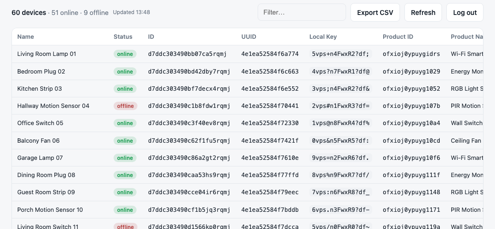
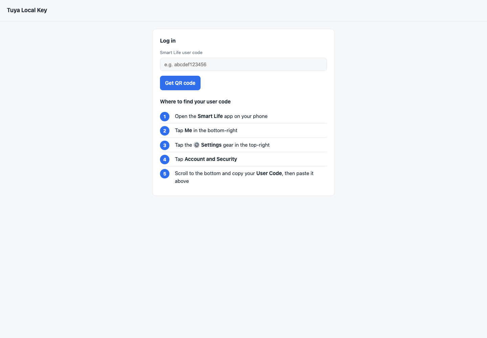
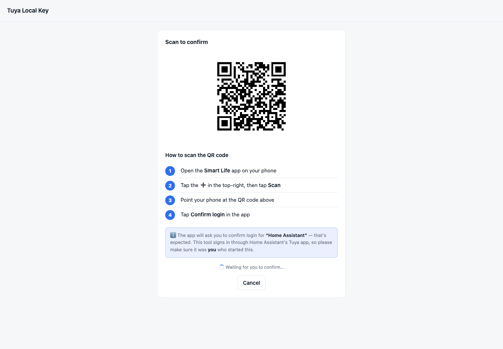
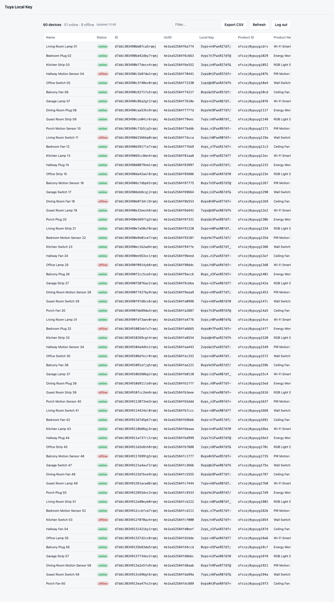
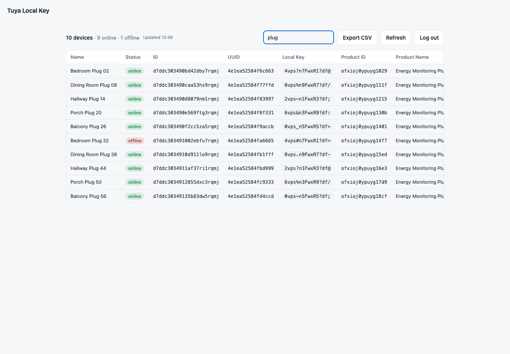

# Tuya Local Key

Tuya Local Key helps you retrieve the local keys for devices in your Smart Life / Tuya account, along with device ID, UUID, product details, category, IP address, online status, and timestamps.

<picture>
  <source media="(prefers-color-scheme: dark)" srcset="docs/screenshots/header-devices-dark.png">
  <source media="(prefers-color-scheme: light)" srcset="docs/screenshots/header-devices-light.png">
  
</picture>

<br>

It uses QR-code login through Tuya's official [`tuya-device-sharing-sdk`](https://github.com/tuya/tuya-device-sharing-sdk), using Home Assistant's public device-sharing app registration. You do not need a Tuya IoT developer account, cloud project, Access ID, or Access Secret.

Use it as a self-hosted web UI with Docker or as a local CLI tool.

## Features

- Web UI for QR login, device listing, filtering, local key copy, refresh, logout, and CSV export.
- CLI with the same QR login flow for terminal use.
- Session caching so you do not need to scan a QR code every time.
- Docker and Docker Compose support.
- Home Assistant app support.
- GHCR publishing workflow for multi-architecture images.

## Home Assistant App

Home Assistant OS users can install Tuya Local Key as a Home Assistant app.

1. Go to Settings > Apps > App Store.
2. Open the menu in the top-right and choose Repositories.
3. Add this repository URL:

```text
https://github.com/vineetchoudhary/tuya-local-key
```

4. Install Tuya Local Key from the app store and open it from the sidebar.

The app uses Home Assistant ingress by default. The direct `8000/tcp` port is disabled unless you explicitly enable it in the app network settings.

## Web UI with Docker Compose

The included [docker-compose.yml](docker-compose.yml) runs the published GHCR image and stores the cached login session in a named Docker volume.

Start the app:

```bash
docker compose up -d
```

Open the web UI:

```text
http://localhost:8000
```

If you prefer the `tuyaSmart` QR scheme instead of `smartlife`, edit `QR_SCHEME` in [docker-compose.yml](docker-compose.yml).

## Web UI with Docker

Run the published image directly:

```bash
docker run -d --name tuya-local-key -p 8000:8000 -v tuya-session:/data ghcr.io/vineetchoudhary/tuya-local-key:latest
```

Build and run locally:

```bash
docker build -t tuya-local-key .
docker run -d --name tuya-local-key -p 8000:8000 -v tuya-session:/data tuya-local-key
```

Then open `http://localhost:8000`.

## Web Login Flow

1. Enter your Smart Life user code.
2. Scan the QR code in the Smart Life app.
3. Tap Confirm login in the app.
4. View, filter, copy, refresh, and export your devices.

## Configuration

| Environment variable | Default | Description |
|---|---|---|
| `SESSION_FILE` | `/data/session.json` | Path where the cached login session is stored. |
| `QR_SCHEME` | `tuyaSmart` | QR prefix. `smartlife` also works and is used by the included Compose file. |
| `PORT` | `8000` | Server port used by the Flask development server. The Docker image listens on `8000`. |

> Security note: the web UI has no authentication. Anyone who can reach the port can see device `localKey` values and start a login flow. Run it only on localhost or a trusted private network, or put it behind a reverse proxy with authentication. Do not expose it directly to the internet.

## CLI

Set up the local environment:

```bash
./setup.sh
```

Run the CLI:

```bash
.venv/bin/python tuya_devices.py
```

Install the CLI command into the virtualenv:

```bash
.venv/bin/python -m pip install -e .
.venv/bin/tuya-local-key
```

First run prompts for your Smart Life user code, prints a QR code in the terminal, saves `tuya-login-qr.png` as a fallback, waits for confirmation, and then lists devices. The session is cached at `~/.config/tuya-smartlife/session.json`.

| Flag | Description |
|---|---|
| `--user-code CODE` | Provide the Smart Life user code instead of being prompted. |
| `--json` | Output raw JSON. |
| `--csv PATH` | Also write results to a CSV file. |
| `--relogin` | Ignore the cached session and scan a new QR code. |
| `--logout` | Delete the cached session and exit. |
| `--session PATH` | Use a different session-cache file. |
| `--scheme {tuyaSmart,smartlife}` | QR scheme prefix. |

## Finding Your User Code

In the Smart Life app, go to Me > Settings > Account and Security > User Code.

## Scanning the QR Code

In the Smart Life app, tap + > Scan, point at the QR code, and tap Confirm login.

The app may ask you to confirm login for "Home Assistant". That is expected because this tool signs in through Home Assistant's Tuya app registration. Only confirm if you started the login.

The QR code expires within a minute or two. If it times out, start the login again.


## Demo Screenshots

### Login

<picture>
  <source media="(prefers-color-scheme: dark)" srcset="docs/screenshots/login-dark.png">
  <source media="(prefers-color-scheme: light)" srcset="docs/screenshots/login-light.png">
  
</picture>

### QR Login

<picture>
  <source media="(prefers-color-scheme: dark)" srcset="docs/screenshots/qr-login-dark.png">
  <source media="(prefers-color-scheme: light)" srcset="docs/screenshots/qr-login-light.png">
  
</picture>

### Device Table

<picture>
  <source media="(prefers-color-scheme: dark)" srcset="docs/screenshots/devices-dark.png">
  <source media="(prefers-color-scheme: light)" srcset="docs/screenshots/devices-light.png">
  
</picture>

### Filtering

<picture>
  <source media="(prefers-color-scheme: dark)" srcset="docs/screenshots/filter-dark.png">
  <source media="(prefers-color-scheme: light)" srcset="docs/screenshots/filter-light.png">
  
</picture>

## Troubleshooting

- Terminal QR will not scan: open the saved `tuya-login-qr.png` instead.
- Login timed out or QR expired: start the login again and scan promptly.
- `session_invalid` or redirected back to login: the cached login expired; scan again.
- No devices found: confirm the devices are paired in the Smart Life app under the same account.
