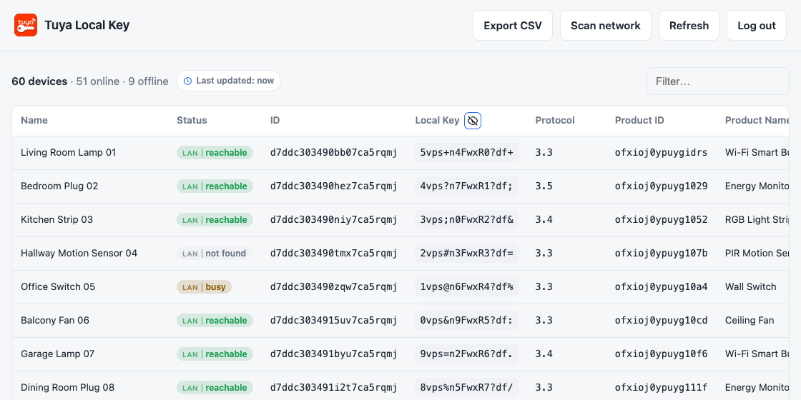
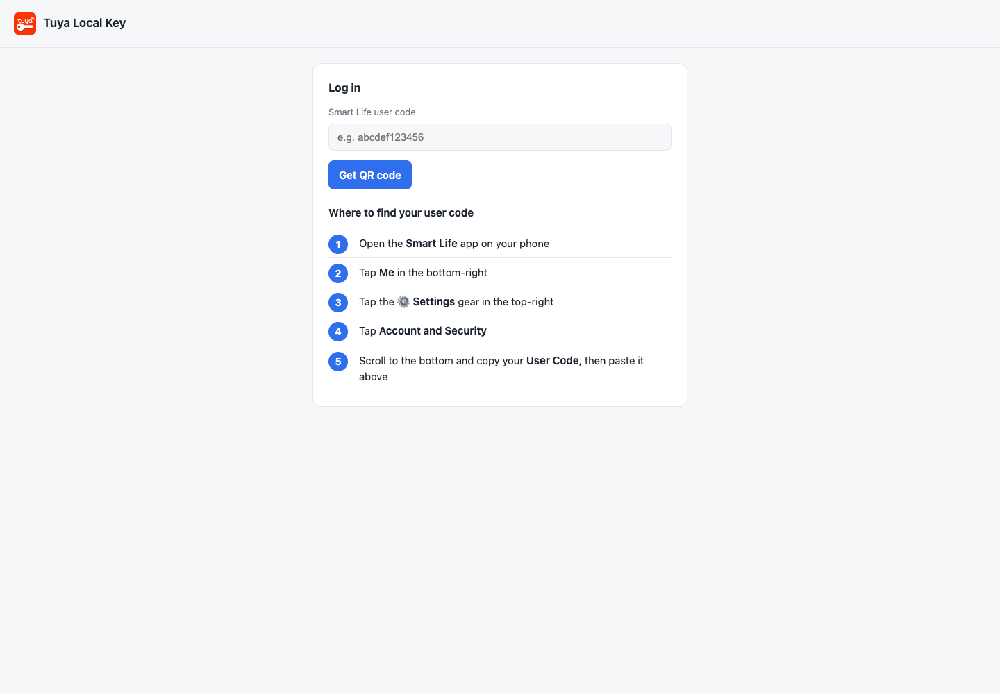
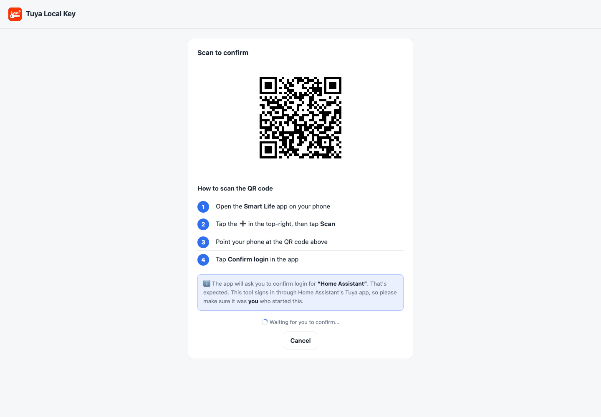
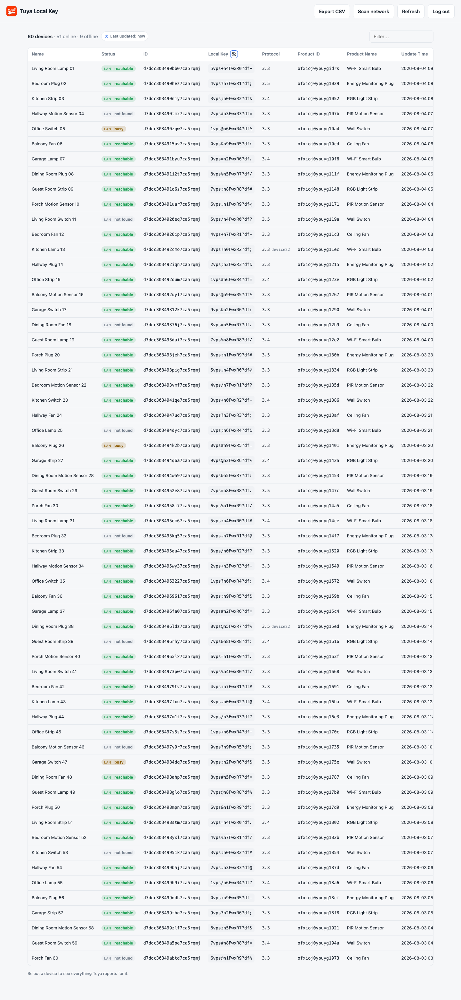
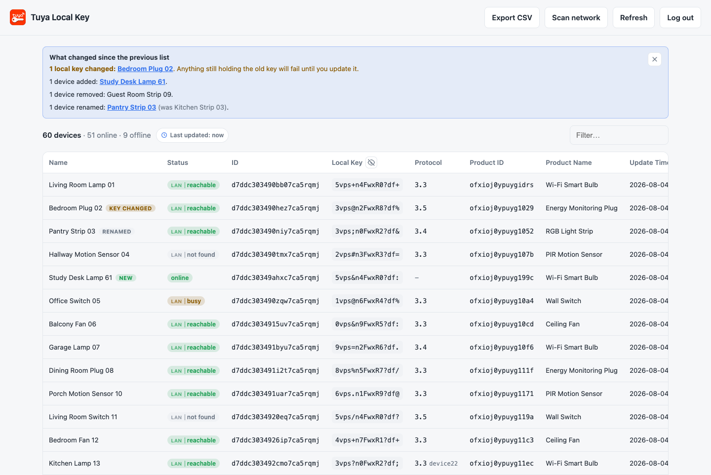
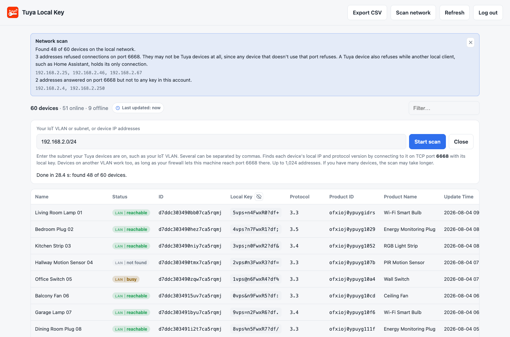
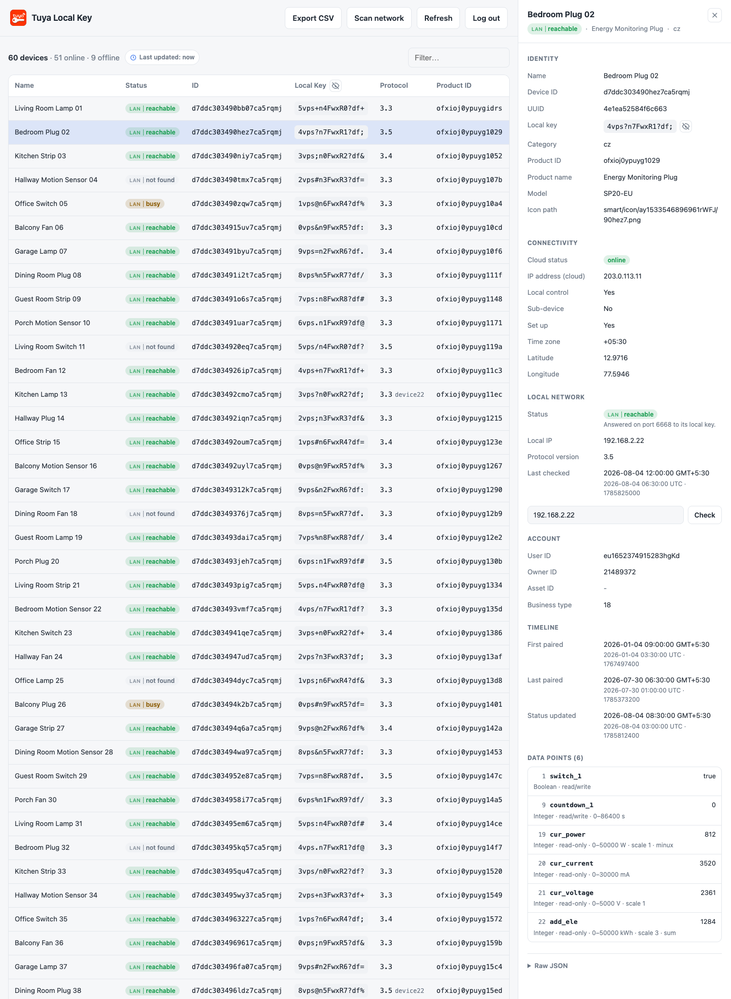
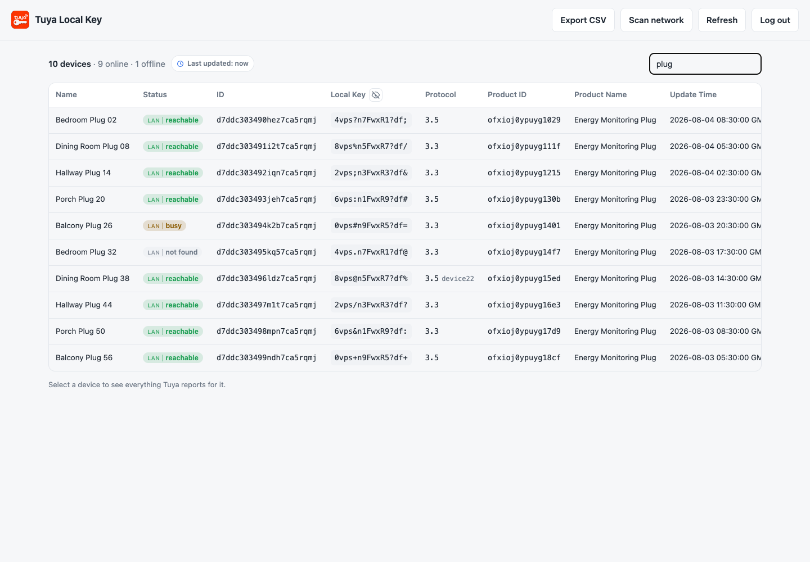

[](https://github.com/sponsors/vineetchoudhary)
[](https://buymeacoffee.com/vineetchoudhary)
[](https://github.com/vineetchoudhary/tuya-local-key/actions/workflows/docker-publish.yml)
[](https://github.com/vineetchoudhary/tuya-local-key/pkgs/container/tuya-local-key)

# Tuya Local Key

Tuya Local Key helps you retrieve the local keys for devices in your Smart Life / Tuya account, along with device ID, UUID, product details, category, online status, timestamps, and every data point the device reports. A network scan adds each device's local IP address and Tuya protocol version.

<picture>
  <source media="(prefers-color-scheme: dark)" srcset="docs/screenshots/header-devices-dark.png">
  <source media="(prefers-color-scheme: light)" srcset="docs/screenshots/header-devices-light.png">
  
</picture>

<br>

It uses QR-code login through Tuya's official [`tuya-device-sharing-sdk`](https://github.com/tuya/tuya-device-sharing-sdk), using Home Assistant's public device-sharing app registration. You do not need a Tuya IoT developer account, cloud project, Access ID, or Access Secret.

Use it as a self-hosted web UI with Docker or as a local CLI tool.

## Features

- Web UI for QR login, device listing, filtering, local key copy, refresh, logout, and CSV export.
- Device details panel with every field the device-sharing SDK returns, including current data point values, their specifications, and the local data point id mapping.
- CLI with the same QR login flow for terminal use.
- Session caching so you do not need to scan a QR code every time.
- Encrypted device-list cache that survives restarts, so the list loads without waiting on Tuya.
- Change detection on every refresh, including the local key rotations that silently break local integrations.
- Network scan for each device's local IP and protocol version (3.1, 3.3, 3.4, 3.5, device22), across VLANs, with changed versions flagged like changed keys.
- Saved list stays readable when Tuya is unreachable or your login expires.
- Docker and Docker Compose support.
- Home Assistant app support.
- GHCR publishing workflow for multi-architecture images.

## Home Assistant App

Home Assistant OS users can install Tuya Local Key as a Home Assistant app.

1. Go to Settings > Apps > App Store.
2. Open the menu in the top-right and choose Repositories.
3. Add this repository URL:

```text
https://github.com/vineetchoudhary/tuya-local-key
```

4. Install Tuya Local Key from the app store and open it from the sidebar.

The app uses Home Assistant ingress by default. The direct `8000/tcp` port is disabled unless you explicitly enable it in the app network settings.

## Web UI with Docker Compose

The included [docker-compose.yml](docker-compose.yml) runs the published GHCR image and stores the cached login session and device list in a named Docker volume.

Start the app:

```bash
docker compose up -d
```

Open the web UI:

```text
http://localhost:8000
```

If you prefer the `tuyaSmart` QR scheme instead of `smartlife`, edit `QR_SCHEME` in [docker-compose.yml](docker-compose.yml).

## Web UI with Docker

Run the published image directly:

```bash
docker run -d --name tuya-local-key -p 8000:8000 -v tuya-session:/data ghcr.io/vineetchoudhary/tuya-local-key:latest
```

Build and run locally:

```bash
docker build -t tuya-local-key .
docker run -d --name tuya-local-key -p 8000:8000 -v tuya-session:/data tuya-local-key
```

Then open `http://localhost:8000`.

## Web UI from Source

Set up the local environment, then add the web dependencies:

```bash
./setup.sh
.venv/bin/python -m pip install -r requirements-web.txt
```

Serve it with waitress, the same server the Docker image uses:

```bash
.venv/bin/waitress-serve --listen=127.0.0.1:8000 app:app
```

Then open `http://localhost:8000`. It shares the CLI's saved login in `~/.config/tuya-smartlife/session.json`. To reach it from other devices, listen on `0.0.0.0:8000` instead, and read the security note under [Configuration](#configuration) first.

## Web Login Flow

1. Enter your Smart Life user code.
2. Scan the QR code in the Smart Life app.
3. Tap Confirm login in the app.
4. View, filter, copy, refresh, and export your devices.
5. Select a device row to open its details panel.

The web UI caches the device list for 3 days and keeps it across restarts. Click Refresh to get the latest list from Tuya. See [Device List Cache](#device-list-cache).

## Device Details

Selecting a device row opens a side panel with everything the device-sharing SDK reports for it:

| Section | Contents |
|---|---|
| Identity | Name, device ID, UUID, local key, category, product ID and name, model, icon path. |
| Connectivity | Cloud online status, the IP address Tuya reports (your WAN address, not the device's), local-control support, sub-device flag, node and gateway ids, time zone, coordinates. |
| Local network | What the last [network scan](#protocol-version) found: local IP, protocol version, status, and when it was checked, with a Check button for this one device. |
| Account | User, owner, and asset ids. |
| Timeline | First paired, last paired, and status-updated times in your local timezone, with the UTC reading and the raw epoch below each one. |
| Data points | Every data point: local dp id, code, current value, type, read/write access, and value range. |
| Raw JSON | The complete device record, with a copy button. |

Fields Tuya returns that are not listed above appear under "Other fields", so nothing is hidden. The dp id shown next to each data point code is the mapping local integrations such as LocalTuya and tuya-local need.

The device table shows the columns you scan most. UUID, category, IP address, and the last-paired time live in the panel. CSV export and `--json` still include every field.

Timestamps in the web UI use your browser's timezone, so the same list reads differently on different machines. CSV export and the CLI stay in UTC.

## Device List Cache

The device list is cached for 3 days and stored next to your session file, so restarting the container or updating the Home Assistant app shows your devices immediately instead of re-fetching them from Tuya. Click Refresh at any time to pull the current list.

That cached list contains every local key in your account, so it is encrypted at rest with a key kept beside it:

| File | Contents |
|---|---|
| `devices.cache` | The encrypted device list. |
| `lan.cache` | The encrypted [network scan](#protocol-version) results. |
| `cache.key` | The key that decrypts both. |

They are written readable only by the user the app runs as. Logging out deletes them all. Deleting the key is the deliberate part: any copy of `devices.cache` that survives somewhere else, in a backup or a volume snapshot, can never be read again.

This protects a cache file that leaks on its own. It is **not** protection against someone who can read the whole data directory, because the key sits next to the file it unlocks. That directory already holds `session.json`, whose tokens can fetch the same local keys from Tuya, so treat the directory itself as the secret either way.

Set `DEVICE_CACHE` to `off` to keep the device list in memory only and never write it to disk. The list is then fetched from Tuya again after every restart.

### When Tuya Cannot Be Reached

If a fetch fails, the saved list is shown instead of an error, labelled as a snapshot with its age.

The same applies when your login expires. Local keys do not expire with the login, so the saved list is still correct: it stays on screen, and the notice offers to log in again rather than dropping you at the login screen with nothing. Logging out is what clears the saved list.

## Change Detection

Every refresh is compared against the list you saw before it, and anything that moved is summarised above the table.

- **Local key changed.** This is the one that matters. Tuya rotates a device's local key when the device is re-paired, and sometimes after a firmware update. Nothing announces it, so LocalTuya, tinytuya, or tuya-local simply stop decrypting that device. The summary names which key moved.
- **Devices added or removed.**
- **Devices renamed**, with the name they had before.

A [network scan](#protocol-version) is compared against the scan before it in the same way, and its findings join the same summary:

- **Protocol version changed.** A firmware update can move a device from 3.3 to 3.4 or 3.5, and a local integration still set to the old version stops working.
- **Local IP changed**, with the old and new address.
- **Local key no longer accepted.** The device answered at its address but not to its key. If Tuya lists a new key for it, the summary says so. Otherwise, click Refresh to check.

Changed rows are badged in the table so they are findable in a long list, and the filter box matches the badge text: type `key changed` to narrow to just those. Selecting a device name in the summary opens its details panel, where the new key is ready to copy.

The summary is a comparison, so the first list after logging in never has one, and switching accounts does not report every device as new. Dismissing it hides it until the next refresh finds something. Key values never appear in the summary itself, only the fact that one changed.

## Protocol Version

Local-control tools such as tinytuya, tuya-local and LocalTuya need each device's protocol version as well as its local key. Tuya's device-sharing API doesn't return one, and the IP address it reports is your WAN address, so both have to come from the device itself.

Click **Scan network**, enter your IoT VLAN or subnet, the one your Tuya devices are on (for example `192.168.2.0/24`, or several separated by commas, up to 1,024 addresses), and start the scan. The app then:

1. Opens a plain TCP connection to port 6668 on every address, to find the ones listening.
2. Asks each of those addresses for a device's status with that device's local key, trying 3.3, 3.4 and 3.5 in turn, then 3.1. A device only answers to its own key, so a reply identifies it.

A first scan of a /24 takes about 30 seconds for a typical home. An account with many devices takes longer, up to a few minutes, because each address that answers is asked with every key not yet matched. The results are saved, so later visits show them straight away. The next scan checks each device at its last address first, so a device that hasn't moved is found in about a second, but the scan still starts by checking every address, which takes several seconds on a /24. A scan never runs on its own: Refresh only reloads the list from Tuya.

For a device the scan missed, open its details panel and use **Check** with its IP address (for example `192.168.2.1`), which you can find in your router's client list. A Check that fails at an address the device wasn't known at only reports the result. It doesn't replace what the last scan saved.

### Networks and Firewalls

The scan makes ordinary routed TCP connections and never relies on broadcasts, so it works when your devices are on a different VLAN from the app. Allow TCP port 6668 from the machine running Tuya Local Key to the IoT network. From Docker or the Home Assistant app, connections leave with the host's address, so the rule is for the host. The IoT network needs no access back. Set `LAN_SUBNET` to prefill the scan box.

### What the Status Column Shows

After a scan, the Status column shows what the device did when asked, tagged `LAN`. Devices without a scan result still show the cloud's online flag, which is often wrong about devices that are on your network.

| Status | Meaning |
|---|---|
| reachable | Answered on port 6668 to its local key. |
| via gateway | A Zigbee or Bluetooth sub-device. It shares its gateway's key and is reached at the gateway's IP and version. It has no protocol version of its own, so its Protocol column stays empty, and its details panel shows the gateway's IP and version. It is greyed out when the scan didn't find the gateway. See [Gateways](#gateways). |
| offline | A sub-device whose gateway answered, but reports it offline. The scan asks each gateway it finds which of its sub-devices are online, since the gateway answering says nothing about them. |
| check needed | A gateway Tuya lists without a key, which the last scan found but couldn't tell apart from your other gateways. Check it at its IP. See [Gateways](#gateways). |
| busy | Refused the connection at its last known IP. Tuya devices accept only one local connection, so a device already connected to Home Assistant or another local client refuses new ones. A manual Check will be refused too until that client lets go. |
| key mismatch | Answered at its last known IP, but not to its key, at the version it used before, twice in a row. The key has probably changed, so click Refresh. Another device may also have taken that IP. |
| unreachable | Didn't answer at its last known IP. |
| not found | No scanned address answered to its key. |

The scan never holds a connection itself. Each check opens a connection, asks once and closes it, usually within a fraction of a second, or after a few seconds for an address that doesn't answer. It never has more than one connection open to an address, so a local integration that reconnects at that exact moment only has to retry, as it does after any dropped connection.

The scan summary lists the addresses that refused connections, the ones that answered but not to any key in your account, and any that ran out of time before every key was tried, so you can match them against your router's client list. An address that refuses isn't necessarily a Tuya device: any device that doesn't use port 6668 refuses it. The .1 that starts each subnet you enter, where a router usually sits, is still scanned but left out of these lists unless one of your devices answers there.

### Gateways

Tuya's device-sharing API can list a Zigbee or Bluetooth gateway with no local key, and put the gateway's key on each of its sub-devices instead. It doesn't say which sub-devices belong to which gateway, and it can mark the gateway itself as a sub-device. The scan tells gateways apart by their category, and tries the keys on your sub-devices at each address that answers.

- **One gateway without a key:** it gets the key its sub-devices carry. Its row shows that key, marked with an asterisk, along with its IP and version. The asterisk's tooltip and a note below the table say the key comes from a sub-device.
- **Several gateways without a key:** the scan still finds where each key answers, so every sub-device gets its gateway's IP and version. Tuya's data doesn't say which gateway is at which address, so the gateways show **check needed**, and the scan summary lists each address with the sub-devices whose key answered there. Open a gateway and **Check** it at its IP, with one click on the address its sub-devices point to, or one from your router's client list. The key it answers to becomes its key, and later scans remember it. When that leaves only one gateway, it's checked too, so two gateways take one click. A gateway checked at the wrong IP takes the other gateway's key, so check it again at the right one.

In the CSV export and the CLI, a sub-device keeps its gateway's IP and version, which local tools need to reach it, and `lan_gateway_id` names that gateway. `lan_sub_online` says whether that gateway reports it online, and is empty when the gateway didn't say.

### device22

Some devices need a quirk tinytuya calls `device22`. The Protocol column marks it next to the version, and the details panel gives the name tuya-local uses: `3.22` for 3.3 with the quirk, `3.42` for 3.4. Version 3.2 behaves exactly like 3.3 with the quirk, so the scan reports it that way.

## Bluetooth Devices

Bluetooth-only devices show `-` in the Local Key column. This is not a bug in this tool. Tuya's device-sharing API does not return a `local_key` for them, so there is nothing to display. The SDK builds each device record straight from Tuya's response, so a field Tuya omits is simply absent. You can confirm this in the Raw JSON section of the details panel, where the `local_key` line is missing entirely rather than empty.

Tuya documents `local_key` as the ["unique encrypted key of the specified device over LAN"](https://developer.tuya.com/en/docs/cloud/9f0ad495f5?id=Kfpa9zysx687w). A Bluetooth-only device has no LAN presence, and Tuya's [Bluetooth pairing docs](https://developer.tuya.com/en/docs/app-development/activator_ble_ios?id=Kcy2u7zj5hwkf) describe the connection as point-to-point between phone and device, so the app-side API this tool logs into has no LAN key to hand out.

### Bluetooth Devices Behind a Gateway

Pairing a Bluetooth device to a Tuya Bluetooth or SigMesh gateway makes a local key appear. That key belongs to the gateway, not to the device: every sub-device under the same gateway shows the same value, because sub-devices are reached over LAN through the gateway. Treat it as the gateway's key. It will not authenticate a direct Bluetooth connection to the device.

## Configuration

| Environment variable | Default | Description |
|---|---|---|
| `SESSION_FILE` | `/data/session.json` | Path where the cached login session is stored. |
| `QR_SCHEME` | `smartlife` | QR prefix. Use `tuyaSmart` if scanning or confirmation does not work for your account. |
| `PORT` | `8000` | Port the web UI listens on, in the Docker image and in the Flask development server. |
| `AUTH_USERNAME` | _(unset)_ | Username for optional HTTP Basic Auth. Login is required only when **both** `AUTH_USERNAME` and `AUTH_PASSWORD` are set. Ignored under Home Assistant ingress. |
| `AUTH_PASSWORD` | _(unset)_ | Password for optional HTTP Basic Auth. Ignored under Home Assistant ingress. |
| `DEVICE_CACHE` | `on` | Set to `off` to keep the device list in memory only instead of storing it. See [Device List Cache](#device-list-cache). |
| `DEVICE_CACHE_FILE` | `devices.cache` beside `SESSION_FILE` | Path of the encrypted device-list cache. |
| `DEVICE_CACHE_KEY_FILE` | `cache.key` beside `SESSION_FILE` | Path of the key that decrypts the device-list cache and the scan results. |
| `LAN_CACHE_FILE` | `lan.cache` beside `SESSION_FILE` | Path of the encrypted network scan results. |
| `LAN_SUBNET` | _(unset)_ | Your IoT VLAN or subnet, to prefill the Scan network box, e.g. `192.168.2.0/24`. Several can be comma-separated. See [Protocol Version](#protocol-version). |

> Security note: by default the web UI has no authentication, so anyone who can reach the port can see device `localKey` values. Set **both** `AUTH_USERNAME` and `AUTH_PASSWORD` to require a login. This is recommended whenever the port is reachable beyond localhost. Basic Auth sends credentials unencrypted over plain HTTP, so still keep it on a trusted network or behind a TLS reverse proxy, and do not expose it directly to the internet. On Home Assistant, ingress already authenticates access, so these credentials are **ignored for ingress requests**. Set them only if you enable the direct port access and want a separate login there. The device list is also stored on disk, encrypted. See [Device List Cache](#device-list-cache) for what that does and does not protect.

## CLI

Set up the local environment:

```bash
./setup.sh
```

Run the CLI:

```bash
.venv/bin/python tuya_devices.py
```

Install the CLI command into the virtualenv:

```bash
.venv/bin/python -m pip install -e .
.venv/bin/tuya-local-key
```

First run prompts for your Smart Life user code, prints a QR code in the terminal, saves `tuya-login-qr.png` as a fallback, waits for confirmation, and then lists devices. The session is cached at `~/.config/tuya-smartlife/session.json`.

| Flag | Description |
|---|---|
| `--user-code CODE` | Provide the Smart Life user code instead of being prompted. |
| `--json` | Output raw JSON. |
| `--csv PATH` | Also write results to a CSV file. |
| `--scan TARGETS` | Also find each device's local IP and protocol version, using your IoT VLAN or subnet, e.g. `--scan 192.168.2.0/24`. Adds `local_ip`, `protocol_version`, `device22` and `lan_status` to every output. A sub-device also gets `lan_gateway_id`, the gateway whose IP and version it has, and `lan_sub_online` when that gateway reports whether it is online. A gateway Tuya lists without a key gets `local_key` and `local_key_from` from its sub-device. See [Protocol Version](#protocol-version). |
| `--relogin` | Ignore the cached session and scan a new QR code. |
| `--logout` | Delete the cached session and exit. |
| `--session PATH` | Use a different session-cache file. |
| `--scheme {tuyaSmart,smartlife}` | QR scheme prefix. |

## Finding Your User Code

In the Smart Life app, go to Me > Settings > Account and Security > User Code.

## Scanning the QR Code

In the Smart Life app, tap + > Scan, point at the QR code, and tap Confirm login.

The app may ask you to confirm login for "Home Assistant". That is expected because this tool signs in through Home Assistant's Tuya app registration. Only confirm if you started the login.

The QR code expires within a minute or two. If it times out, start the login again.


## Demo Screenshots

### Login

<picture>
  <source media="(prefers-color-scheme: dark)" srcset="docs/screenshots/login-dark.png">
  <source media="(prefers-color-scheme: light)" srcset="docs/screenshots/login-light.png">
  
</picture>

### QR Login

<picture>
  <source media="(prefers-color-scheme: dark)" srcset="docs/screenshots/qr-login-dark.png">
  <source media="(prefers-color-scheme: light)" srcset="docs/screenshots/qr-login-light.png">
  
</picture>

### Device Table

<picture>
  <source media="(prefers-color-scheme: dark)" srcset="docs/screenshots/devices-dark.png">
  <source media="(prefers-color-scheme: light)" srcset="docs/screenshots/devices-light.png">
  
</picture>

### Change Summary

<picture>
  <source media="(prefers-color-scheme: dark)" srcset="docs/screenshots/changes-dark.png">
  <source media="(prefers-color-scheme: light)" srcset="docs/screenshots/changes-light.png">
  
</picture>

### Network Scan

<picture>
  <source media="(prefers-color-scheme: dark)" srcset="docs/screenshots/scan-dark.png">
  <source media="(prefers-color-scheme: light)" srcset="docs/screenshots/scan-light.png">
  
</picture>

### Device Details

<picture>
  <source media="(prefers-color-scheme: dark)" srcset="docs/screenshots/details-dark.png">
  <source media="(prefers-color-scheme: light)" srcset="docs/screenshots/details-light.png">
  
</picture>

### Filtering

<picture>
  <source media="(prefers-color-scheme: dark)" srcset="docs/screenshots/filter-dark.png">
  <source media="(prefers-color-scheme: light)" srcset="docs/screenshots/filter-light.png">
  
</picture>

## Troubleshooting

- Terminal QR will not scan: open the saved `tuya-login-qr.png` instead.
- Login timed out or QR expired: start the login again and scan promptly.
- `session_invalid` or redirected back to login: the cached login expired. Scan the QR code again.
- No devices found: confirm the devices are paired in the Smart Life app under the same account.
- Local key shows `-`: the device is Bluetooth-only. See [Bluetooth Devices](#bluetooth-devices).
- A device stopped working with a local integration: its local key may have rotated. Click Refresh and read the change summary. See [Change Detection](#change-detection).
- "Could not reach Tuya" with the list still shown: that is the saved snapshot. Try Refresh again.

## License

Tuya Local Key is licensed under the [Apache License, Version 2.0](LICENSE). See [NOTICE](NOTICE) for attribution information.

## Support

If this project has been useful to you, consider supporting its continued development.

<a href="https://github.com/sponsors/vineetchoudhary">
  
</a>
&nbsp;
<a href="https://buymeacoffee.com/vineetchoudhary">
  
</a>

Thank you for supporting open source! 🙏
